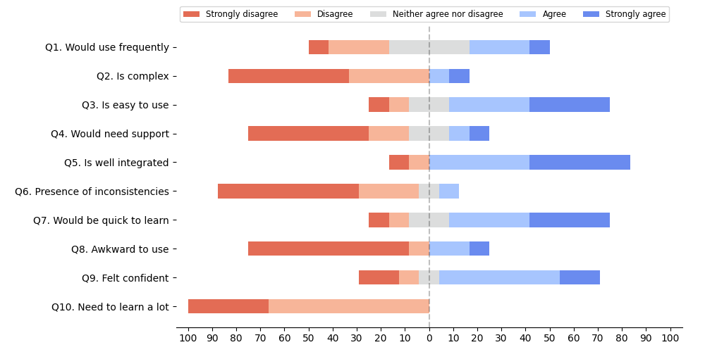

# Ummi usability
> This repo contains data related to an experiment in relation with the Ummi project. 

## SUS Questionnaire results
Average SUS Score: 71.67

| Participant | 1  | 2  | 3    | 4  | 5  | 6  | 7    | 8  | 9    | 10 | 11   | 12 |
|-------------|----|----|------|----|----|----|------|----|------|----|------|----|
| Score       | 90 | 80 | 82.5 | 75 | 90 | 65 | 82.5 | 20 | 32.5 | 75 | 97.5 | 70 |

